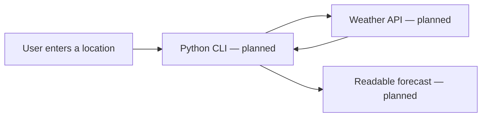
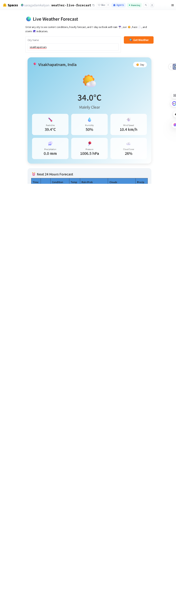

# Weather Forecast App

<strong>A weather forecast project showcase for current conditions such as temperature, humidity, wind, and weather status.</strong>

## Project overview

The project notes describe a Python command-line forecast app using a weather API. The repository currently contains README and presentation images, but no Python source, dependency list, or environment example. It cannot be run locally from this repository yet.

## Intended data flow

This is a conceptual flow based on the project description, not a verified implementation diagram.

## Project visuals

## Make it runnable

Add the CLI source, API-provider instructions, dependency file, and a `.env.example` that contains variable names only. Keep the provider key out of Git. Include sample output and note API quotas and forecast limitations.
